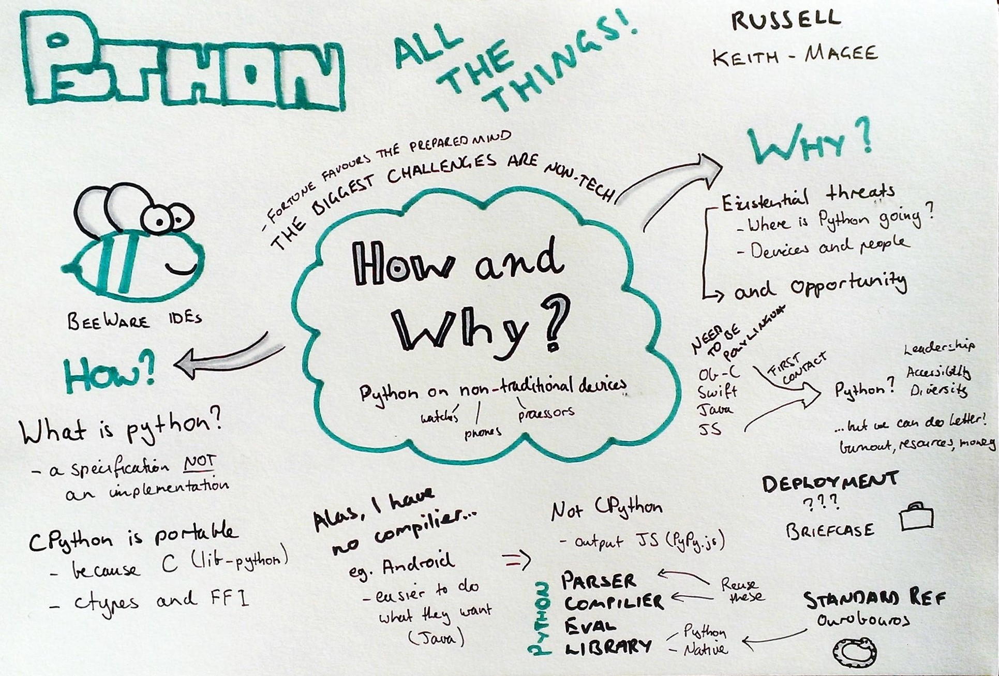
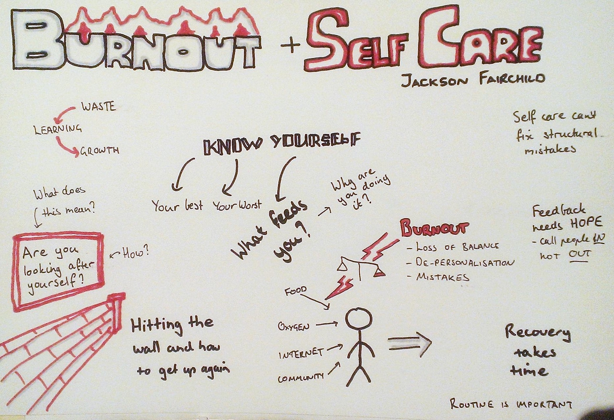

Over the weekend I attended [PyCon Australia](https://2016.pycon-au.org/). This
was my first time at a purely tech conference and I couldn't help but compare
it to my previous experiences at scientific conferences.

**DISCLAIMER:** Like I said this was my first tech conference and my scientific
conference experience is also fairly limited so some of the comments I make
might be generalisations that don't always apply.

PyCon started with miniconfs on Friday and continued coding sprints on Monday
and Tuesday. I didn't attend any of these so my experience was only of the main
conference on Saturday and Sunday. Here are some of the highlights for me in
terms of presentations:

* Andrew Lonsdale - [Python for science, side projects and stuff!](https://www.youtube.com/watch?v=PCZS9wqBUuE)
* Alexander Hogue - [Graphing when your Facebook friends are awake](https://www.youtube.com/watch?v=MkSkqMvGBuo) - Story of discovering a
  hidden Facebook API and using it to track when your friends are online.
  Thoroughly entertaining while still providing the technical details.
* Rachel Bunder - [I wish I learnt that earlier!](https://www.youtube.com/watch?v=cy5n6XAtA-w) - Description of some of the slightly more advanced features available in
  Python. Could be a great intro for someone new to Python.
* Russell Keith-Magee - [Python All the Things](https://www.youtube.com/watch?v=1sDyVJm3Ht0)
  
* Sebastian Vetter - [Click: A Pleasure To Write, A Pleasure To Use](https://www.youtube.com/watch?v=bsJFMtQ5MZU) - Click is an argument parsing
  library with additional features beyond argparse. Also apparently becoming the
  standard at Facebook (didn't learn that at the conference, but it's a fun
  fact).
* Justin Warren - [Predicting the TripleJ Hottest 100 With Python](https://www.youtube.com/watch?v=qjTc5q7MsMg) - Overview of predicting
  the Hottest 100 for the last few years, starting with the method used by the
  [Warmest 100](http://warmest100.com.au/2013/index.html) and continuing on how
  to extract and process information from Instagram.
* Jackson Fairchild - [Hitting the Wall and How to Get Up Again - Tackling Burnout and Strategies for Self Care](https://www.youtube.com/watch?v=Rdc06jpjVIY)
  

(Full schedules for [Saturday](https://2016.pycon-au.org/programme/schedule/saturday?_code=301) and [Sunday](https://2016.pycon-au.org/programme/schedule/sunday?_code=301)
and links to videos are available on the PyCon website)

Overall I was really impressed by the quality of the talks. There were a couple
that I thought could be improved a bit or where I wasn't that interested in the
content but there were no flat-out bad talks like you often see in the
scientific context. It was clear that the presenters had put a lot of effort
into planning what they were going to say and how to make that interesting and
engaging for an audience that might be new to the topic. I don't think I saw
any slides that were walls of text or full of multiple plots. On the other had
there was lots of code in slides, including live snippets. I'm not usually a
fan of this but in the context it makes sense, particularly as you can assume
that everyone has a basic grasp of Python. There were also lots of live demos,
some of which were pretty impressive, and I don't think I saw any fail.

What struck me as being the biggest differences at PyCon compared to a
scientific conference was the sense of a community and awareness of wider
social issues. There was a big effort to be inclusive to all genders,
sexualities, ethnic groups etc. and several of the talks touched on ethical
issues or the speaker's own experience in the community. While I would hope
that a scientific gathering wouldn't be discriminatory I can't see diversity
being embraced in the same way, but hopefully that will continue to improve.
There was a sense of everyone being in it together and it was common for
speakers to praise work that they hadn't been involved in, but thought was
interesting or useful. I didn't see anyone described using their titles and it
seemed that someone who had learned Python in the last year was as valued as
someone who had been a major contributor for the last 10 years (although there
may had been power dynamics that I wasn't aware of).

I think that a lot of the differences come from the work/volunteer divide.
While PyCon was an opportunity to network or advertise your work the focus
seemed to be on contributing to the community and the speakers were
enthusiastic and keen to present. In contrast a scientific conference is a
professional opportunity. As a scientist you are judged on your ability to get
a talk which means more competition and sometimes speakers who aren't
interested in presenting. Every talk is a demonstration of your worth which
makes it hard to present unfinished work and encourages people to try and fit
to much in. It would be great for scientific conferences to spend more time
discussing issues around thecommunities they represent but to do so they might
have to sacrificeopportunities. For example it would be great to see a talk
about mental health issues like Jackson Fairchild's but that would mean taking
away a spot from someone that might need it to progress their career.
Personally I think we could maybe do with less talks from whichever well known
person is doing the rounds in favour of some outside experts.

Overall I enjoyed my time at PyCon. It was a bit different to a scientific
conference and I think there are probably things they can learn from each
other. Congratulations to all the speakers and everyone involved in
organising. Given that it is in Melbourne again I hope to be back next year.
