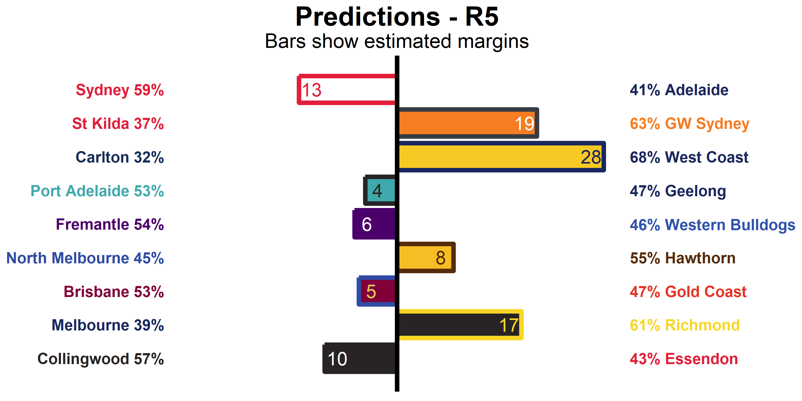
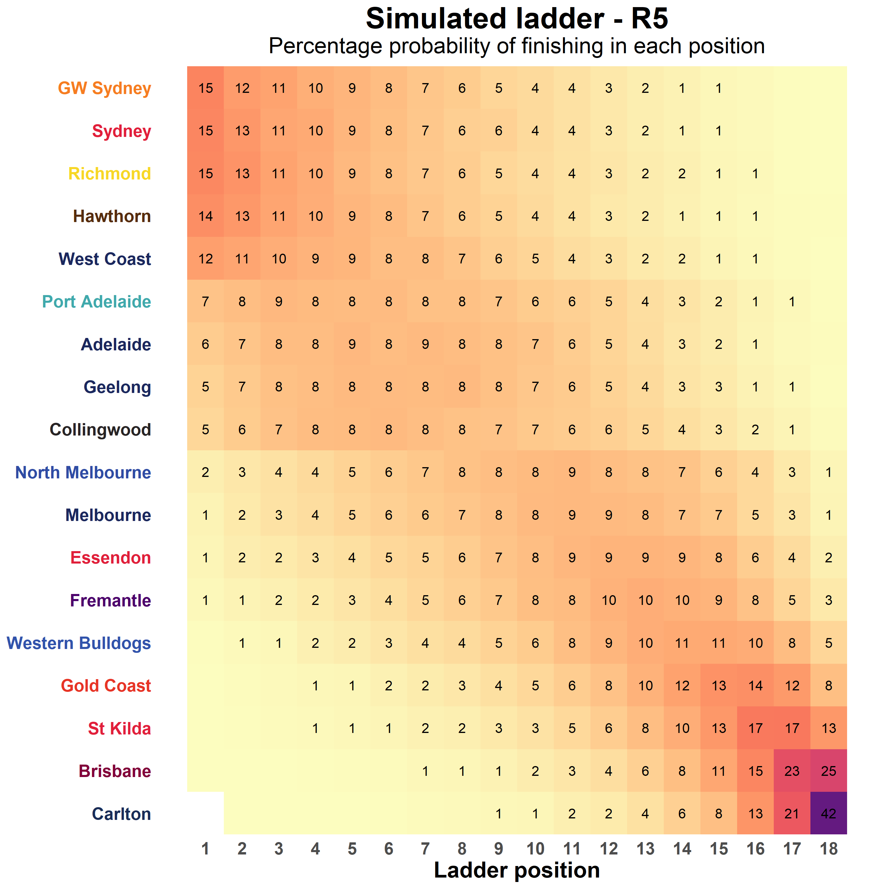
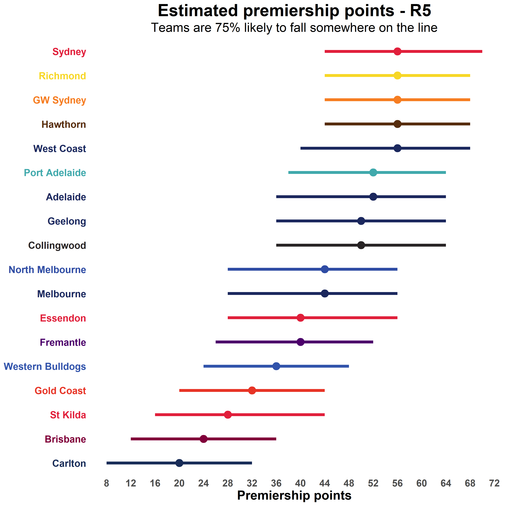
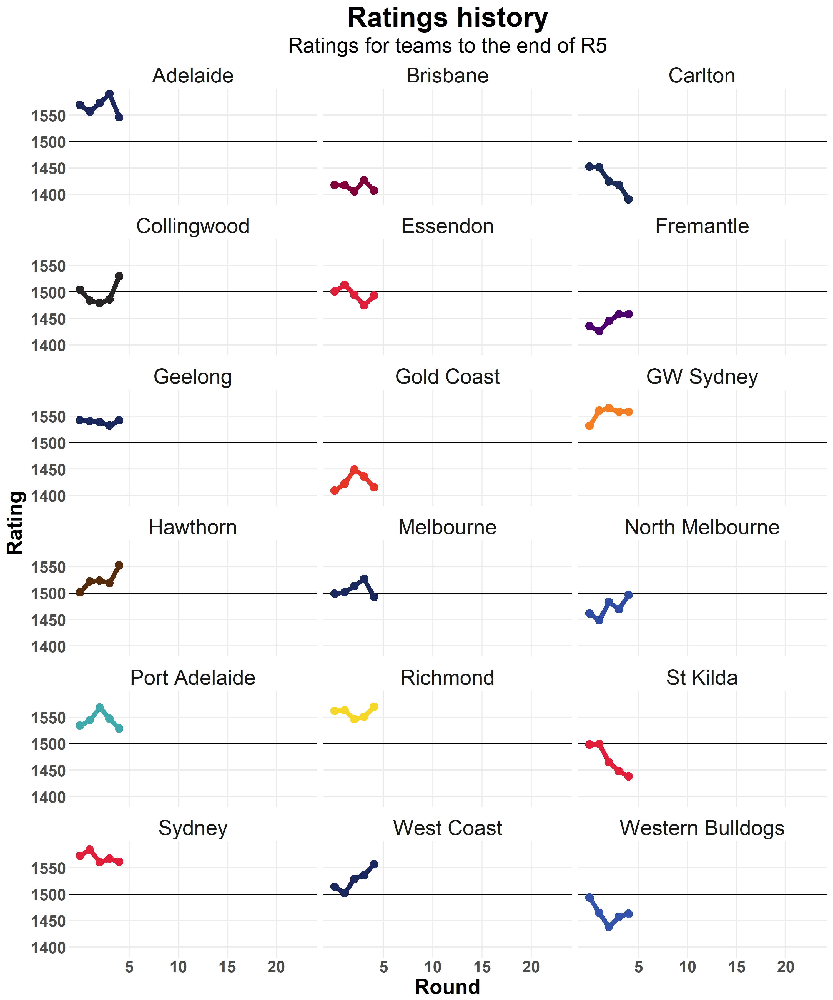

<!-- ```{r knitr, include = FALSE}
knitr::opts_chunk$set(autodep        = TRUE,
                      cache          = FALSE,
                      cache.comments = TRUE,
                      echo           = FALSE,
                      error          = FALSE,
                      fig.align      = "center",
                      fig.width      = 10,
                      fig.height     = 8,
                      message        = FALSE,
                      warning        = FALSE)
``` -->

<!-- ```{r libraries}
library("knitr")
library("here")
library("formattable")
library("tidyverse")
``` -->


Over the last few years I have followed a lot of the work done by
[FiveThiryEight][FiveThirtyEight], particularly their attempts to model and
predict sport. More recently I have discovered there is a community of people
trying to do similar things for the AFL, including [The Arc][TheArc],
[Squiggle][Squiggle], [Matter of Stats][Mos] and [Hurling People Now][HPN].

Many of these modelling projects are based around the [Elo system][Elo]. If you
haven't heard of it before this model is a ranking system originally designed
for chess by a Hungarian physicist. In the simplest form each player (or team)
is assigned a ranking. When a match is played you can estimate a win probability
based on the differences between the rankings. The rankings are then adjusted
based on the result in such a way that unexpected results cause bigger changes
than those that are closer to what was predicted. This model is relatively naive
and simple to implement, no knowledge of the players or teams themselves is
required, just the results of matches, but can still produce good predictions.

Given this I thought it would be a good place to start. My version of the model
is closely based on the one described by The Arc [here][TheArcModel]. There were
a few different things I wanted to try but (as always) everything took longer
than I planned, so what I have done in the end is very similar. The one area
where I have done things differently is the process used to select the
parameters of the model. This part wasn't really described in the post on The
Arc so I was left to my own devices. Here are brief descriptions of the
parameters, but if you are interested I suggest you check out the outline of
the model on The Arc which has a lot more detail:

* **New team rating** - The starting rating for new teams that enter the
  competition (Gold Coast and GWS). Original teams start with a rating of 1500.
* **New season adjustment** - Amount to regress to the mean at the beginning of
  a new season
* **HGA alpha** - Weighting given to travel distance when calculating home
  ground advantage (HGA)
* **HGA beta** - Weighting given to ground experience when calculating HGA
* **p** - Controls how win probabilities are converted to margins
* **k** - Controls how differences between predicted and actual results affect
  ratings. Greater values cause greater changes, meaning the the model reacts
  quicker to what has happened but also that it is more unstable. In many ways
  this is the critical parameter for the Elo model. For this version of the
  model we use three different values:
    * **Early** - Used for the first five rounds of the regular season
    * **Normal** - Used for the remainder of the regular season
    * **Finals** - Used for finals matches

To select these parameters I chose to use a [genetic optimisation algorithm][GA].
Partly because it is potentially able to explore a wider parameter space, but
also because I think they are cool. To do this we need a measure of fitness that
we are aiming for. For sport predictions there are generally two things we want
to know, who is going to win and by how much. Estimating these can often be best
done using different sets of parameters. For this reason I ran the optimisation
procedure three times, once optimising for win prediction accuracy, once
optimising for the mean absolute error in predicting the margin and once for a
50/50 balance between the two. Each optimisation procedure was run for 100
generations with 100 individuals in each generation, training the model on all
AFL games from 1997 to 2016 and assessing performance on the games from 2000
to 2016. This leaves the 2017 season as a validation set to check the selected
parameters. Here the best performing parameter sets from each of the
optimisations compared to the default parameters based on The Arc:

<!-- ```{r opt-summary}
opt_summ <- read_tsv(here("static/data/afl2018/optimisation_summary.tsv"),
                     col_types = cols(
                         .default = col_double(),
                         Version = col_character()
                     ))
opt_summ %>%
    mutate(new_team_rating = round(new_team_rating),
           new_season_adjustment = round(new_season_adjustment, 2),
           hga_alpha = round(hga_alpha, 2),
           hga_beta = round(hga_beta, 2),
           pred_p = round(pred_p, 4),
           adjust_k_early = round(adjust_k_early),
           adjust_k_normal = round(adjust_k_normal),
           adjust_k_finals = round(adjust_k_finals),
           Margin2016 = round(Margin2016, 2),
           Predict2016 = round(Predict2016, 2),
           Margin2017 = round(Margin2017, 2),
           Predict2017 = round(Predict2017, 2)) %>%
    mutate_all(as.character) %>%
    select(-Version) %>%
    rename(NewTeamRating = new_team_rating,
           NewSeasonAdjustment = new_season_adjustment,
           HGA_Alpha = hga_alpha,
           HGA_Beta = hga_beta,
           p = pred_p,
           k_Early = adjust_k_early,
           k_Normal = adjust_k_normal,
           k_Finals = adjust_k_finals) %>%
    t() %>%
    data.frame() %>%
    rename(Default = X1, Margin = X2, Balanced = X3, Prediction = X4) %>%
    kable()
``` -->

<table>
<thead>
<tr class="header">
<th></th>
<th align="left">Default</th>
<th align="left">Margin</th>
<th align="left">Balanced</th>
<th align="left">Prediction</th>
</tr>
</thead>
<tbody>
<tr class="odd">
<td>NewTeamRating</td>
<td align="left">1090</td>
<td align="left">1292</td>
<td align="left">1284</td>
<td align="left">1106</td>
</tr>
<tr class="even">
<td>NewSeasonAdjustment</td>
<td align="left">0.1</td>
<td align="left">0.33</td>
<td align="left">0.39</td>
<td align="left">0.54</td>
</tr>
<tr class="odd">
<td>HGA_Alpha</td>
<td align="left">6</td>
<td align="left">1.33</td>
<td align="left">2.89</td>
<td align="left">2.05</td>
</tr>
<tr class="even">
<td>HGA_Beta</td>
<td align="left">15</td>
<td align="left">12.89</td>
<td align="left">2.1</td>
<td align="left">5.68</td>
</tr>
<tr class="odd">
<td>p</td>
<td align="left">0.0464</td>
<td align="left">0.027</td>
<td align="left">0.0204</td>
<td align="left">0.078</td>
</tr>
<tr class="even">
<td>k_Early</td>
<td align="left">82</td>
<td align="left">92</td>
<td align="left">92</td>
<td align="left">55</td>
</tr>
<tr class="odd">
<td>k_Normal</td>
<td align="left">62</td>
<td align="left">62</td>
<td align="left">42</td>
<td align="left">38</td>
</tr>
<tr class="even">
<td>k_Finals</td>
<td align="left">72</td>
<td align="left">33</td>
<td align="left">80</td>
<td align="left">43</td>
</tr>
<tr class="odd">
<td>Margin2016</td>
<td align="left">29.9</td>
<td align="left">29.82</td>
<td align="left">29.76</td>
<td align="left">32.51</td>
</tr>
<tr class="even">
<td>Predict2016</td>
<td align="left">0.68</td>
<td align="left">0.68</td>
<td align="left">0.68</td>
<td align="left">0.69</td>
</tr>
<tr class="odd">
<td>Margin2017</td>
<td align="left">29.09</td>
<td align="left">28.94</td>
<td align="left">29.23</td>
<td align="left">30.18</td>
</tr>
<tr class="even">
<td>Predict2017</td>
<td align="left">0.61</td>
<td align="left">0.63</td>
<td align="left">0.61</td>
<td align="left">0.62</td>
</tr>
</tbody>
</table>

Based on the 2017 results I decided to go with  the Margin model. Despite being
optimised for margin accuracy it also performed the best at predicting results
in 2017. This might suggest that the optimisation procedure is not ideal, but
that is a problem for another day... Encouragingly, all three of my models
outperform the defaults, which suggests that the results will be somewhere in
the range of the The Arc, and I am more than happy with that.

If you are interested in how I have done things I have made an
[`aflelo`][aflelo] R package which you can install from GitHub and my analysis
and predictions for each round will be available [here][afl2018].

Now that I have a model I can use it to make predictions about the 2018 season!

Round 5
=======

Summary
-------

<!-- ```{r summ_table}
summ_table <- read_rds(here("static/data/afl2018/R5/summary_table.Rds"))
summ_table
``` -->

<table class="table table-condensed">
<thead>
<tr>
<th style="text-align:right;">
Team
</th>
<th style="text-align:right;">
Rating
</th>
<th style="text-align:right;">
Change
</th>
<th style="text-align:right;">
Points
</th>
<th style="text-align:right;">
Percentage
</th>
<th style="text-align:right;">
ProjRating
</th>
<th style="text-align:right;">
ProjPoints
</th>
<th style="text-align:right;">
Top2
</th>
<th style="text-align:right;">
Top4
</th>
<th style="text-align:right;">
Top8
</th>
</tr>
</thead>
<tbody>
<tr>
<td style="text-align:right;">
Richmond
</td>
<td style="text-align:right;">
<span style="display: block; padding: 0 4px; border-radius: 4px; background-color: #add8e6">1570</span>
</td>
<td style="text-align:right;">
<span style="color: green">19</span>
</td>
<td style="text-align:right;">
12
</td>
<td style="text-align:right;">
130
</td>
<td style="text-align:right;">
<span style="display: block; padding: 0 4px; border-radius: 4px; background-color: #add8e6">1555</span>
</td>
<td style="text-align:right;">
56.5
</td>
<td style="text-align:right;">
<span style="display: block; padding: 0 4px; border-radius: 4px; background-color: #ffb6c1">28.2</span>
</td>
<td style="text-align:right;">
<span style="display: block; padding: 0 4px; border-radius: 4px; background-color: #ffb6c1">49.8</span>
</td>
<td style="text-align:right;">
<span style="display: block; padding: 0 4px; border-radius: 4px; background-color: #ffb6c1">78.9</span>
</td>
</tr>
<tr>
<td style="text-align:right;">
Sydney
</td>
<td style="text-align:right;">
<span style="display: block; padding: 0 4px; border-radius: 4px; background-color: #b1d9e7">1561</span>
</td>
<td style="text-align:right;">
<span style="color: red">-6</span>
</td>
<td style="text-align:right;">
12
</td>
<td style="text-align:right;">
108
</td>
<td style="text-align:right;">
<span style="display: block; padding: 0 4px; border-radius: 4px; background-color: #b2dae7">1546</span>
</td>
<td style="text-align:right;">
56.9
</td>
<td style="text-align:right;">
<span style="display: block; padding: 0 4px; border-radius: 4px; background-color: #ffb6c1">27.9</span>
</td>
<td style="text-align:right;">
<span style="display: block; padding: 0 4px; border-radius: 4px; background-color: #ffb6c1">49.4</span>
</td>
<td style="text-align:right;">
<span style="display: block; padding: 0 4px; border-radius: 4px; background-color: #ffb6c1">79.0</span>
</td>
</tr>
<tr>
<td style="text-align:right;">
GW Sydney
</td>
<td style="text-align:right;">
<span style="display: block; padding: 0 4px; border-radius: 4px; background-color: #b2dae7">1558</span>
</td>
<td style="text-align:right;">
<span style="color: green">0</span>
</td>
<td style="text-align:right;">
12
</td>
<td style="text-align:right;">
140
</td>
<td style="text-align:right;">
<span style="display: block; padding: 0 4px; border-radius: 4px; background-color: #b3dbe7">1544</span>
</td>
<td style="text-align:right;">
56.3
</td>
<td style="text-align:right;">
<span style="display: block; padding: 0 4px; border-radius: 4px; background-color: #ffb7c2">27.5</span>
</td>
<td style="text-align:right;">
<span style="display: block; padding: 0 4px; border-radius: 4px; background-color: #ffb7c2">48.7</span>
</td>
<td style="text-align:right;">
<span style="display: block; padding: 0 4px; border-radius: 4px; background-color: #ffb6c1">79.4</span>
</td>
</tr>
<tr>
<td style="text-align:right;">
West Coast
</td>
<td style="text-align:right;">
<span style="display: block; padding: 0 4px; border-radius: 4px; background-color: #b3dbe7">1556</span>
</td>
<td style="text-align:right;">
<span style="color: green">21</span>
</td>
<td style="text-align:right;">
12
</td>
<td style="text-align:right;">
136
</td>
<td style="text-align:right;">
<span style="display: block; padding: 0 4px; border-radius: 4px; background-color: #b2dae7">1545</span>
</td>
<td style="text-align:right;">
54.7
</td>
<td style="text-align:right;">
<span style="display: block; padding: 0 4px; border-radius: 4px; background-color: #ffc3cc">23.0</span>
</td>
<td style="text-align:right;">
<span style="display: block; padding: 0 4px; border-radius: 4px; background-color: #ffc0c9">42.7</span>
</td>
<td style="text-align:right;">
<span style="display: block; padding: 0 4px; border-radius: 4px; background-color: #ffbac4">74.9</span>
</td>
</tr>
<tr>
<td style="text-align:right;">
Hawthorn
</td>
<td style="text-align:right;">
<span style="display: block; padding: 0 4px; border-radius: 4px; background-color: #b4dbe8">1553</span>
</td>
<td style="text-align:right;">
<span style="color: green">34</span>
</td>
<td style="text-align:right;">
12
</td>
<td style="text-align:right;">
127
</td>
<td style="text-align:right;">
<span style="display: block; padding: 0 4px; border-radius: 4px; background-color: #b6dce8">1539</span>
</td>
<td style="text-align:right;">
56.3
</td>
<td style="text-align:right;">
<span style="display: block; padding: 0 4px; border-radius: 4px; background-color: #ffb9c3">26.9</span>
</td>
<td style="text-align:right;">
<span style="display: block; padding: 0 4px; border-radius: 4px; background-color: #ffb8c2">48.2</span>
</td>
<td style="text-align:right;">
<span style="display: block; padding: 0 4px; border-radius: 4px; background-color: #ffb6c1">78.7</span>
</td>
</tr>
<tr>
<td style="text-align:right;">
Adelaide
</td>
<td style="text-align:right;">
<span style="display: block; padding: 0 4px; border-radius: 4px; background-color: #b7dde9">1546</span>
</td>
<td style="text-align:right;">
<span style="color: red">-44</span>
</td>
<td style="text-align:right;">
8
</td>
<td style="text-align:right;">
107
</td>
<td style="text-align:right;">
<span style="display: block; padding: 0 4px; border-radius: 4px; background-color: #b8dde9">1535</span>
</td>
<td style="text-align:right;">
50.7
</td>
<td style="text-align:right;">
<span style="display: block; padding: 0 4px; border-radius: 4px; background-color: #ffdce1">13.3</span>
</td>
<td style="text-align:right;">
<span style="display: block; padding: 0 4px; border-radius: 4px; background-color: #ffd3da">29.7</span>
</td>
<td style="text-align:right;">
<span style="display: block; padding: 0 4px; border-radius: 4px; background-color: #ffc5cd">63.1</span>
</td>
</tr>
<tr>
<td style="text-align:right;">
Geelong
</td>
<td style="text-align:right;">
<span style="display: block; padding: 0 4px; border-radius: 4px; background-color: #b9dee9">1542</span>
</td>
<td style="text-align:right;">
<span style="color: green">10</span>
</td>
<td style="text-align:right;">
8
</td>
<td style="text-align:right;">
109
</td>
<td style="text-align:right;">
<span style="display: block; padding: 0 4px; border-radius: 4px; background-color: #badeea">1532</span>
</td>
<td style="text-align:right;">
50.0
</td>
<td style="text-align:right;">
<span style="display: block; padding: 0 4px; border-radius: 4px; background-color: #ffdfe4">12.0</span>
</td>
<td style="text-align:right;">
<span style="display: block; padding: 0 4px; border-radius: 4px; background-color: #ffd6dc">27.6</span>
</td>
<td style="text-align:right;">
<span style="display: block; padding: 0 4px; border-radius: 4px; background-color: #ffc6cf">61.3</span>
</td>
</tr>
<tr>
<td style="text-align:right;">
Collingwood
</td>
<td style="text-align:right;">
<span style="display: block; padding: 0 4px; border-radius: 4px; background-color: #bfe0eb">1530</span>
</td>
<td style="text-align:right;">
<span style="color: green">44</span>
</td>
<td style="text-align:right;">
8
</td>
<td style="text-align:right;">
107
</td>
<td style="text-align:right;">
<span style="display: block; padding: 0 4px; border-radius: 4px; background-color: #c0e1ec">1521</span>
</td>
<td style="text-align:right;">
49.6
</td>
<td style="text-align:right;">
<span style="display: block; padding: 0 4px; border-radius: 4px; background-color: #ffe2e6">11.1</span>
</td>
<td style="text-align:right;">
<span style="display: block; padding: 0 4px; border-radius: 4px; background-color: #ffd7dd">26.8</span>
</td>
<td style="text-align:right;">
<span style="display: block; padding: 0 4px; border-radius: 4px; background-color: #ffc8d1">59.1</span>
</td>
</tr>
<tr>
<td style="text-align:right;">
Port Adelaide
</td>
<td style="text-align:right;">
<span style="display: block; padding: 0 4px; border-radius: 4px; background-color: #bfe0eb">1529</span>
</td>
<td style="text-align:right;">
<span style="color: red">-18</span>
</td>
<td style="text-align:right;">
12
</td>
<td style="text-align:right;">
117
</td>
<td style="text-align:right;">
<span style="display: block; padding: 0 4px; border-radius: 4px; background-color: #c0e1eb">1522</span>
</td>
<td style="text-align:right;">
51.9
</td>
<td style="text-align:right;">
<span style="display: block; padding: 0 4px; border-radius: 4px; background-color: #ffd7dd">15.4</span>
</td>
<td style="text-align:right;">
<span style="display: block; padding: 0 4px; border-radius: 4px; background-color: #ffcfd6">32.5</span>
</td>
<td style="text-align:right;">
<span style="display: block; padding: 0 4px; border-radius: 4px; background-color: #ffc3cc">64.6</span>
</td>
</tr>
<tr>
<td style="text-align:right;">
North Melbourne
</td>
<td style="text-align:right;">
<span style="display: block; padding: 0 4px; border-radius: 4px; background-color: #cee7f0">1497</span>
</td>
<td style="text-align:right;">
<span style="color: green">28</span>
</td>
<td style="text-align:right;">
8
</td>
<td style="text-align:right;">
134
</td>
<td style="text-align:right;">
<span style="display: block; padding: 0 4px; border-radius: 4px; background-color: #cde7f0">1499</span>
</td>
<td style="text-align:right;">
43.2
</td>
<td style="text-align:right;">
<span style="display: block; padding: 0 4px; border-radius: 4px; background-color: #fff2f4">4.7</span>
</td>
<td style="text-align:right;">
<span style="display: block; padding: 0 4px; border-radius: 4px; background-color: #ffecef">12.6</span>
</td>
<td style="text-align:right;">
<span style="display: block; padding: 0 4px; border-radius: 4px; background-color: #ffdce1">38.4</span>
</td>
</tr>
<tr>
<td style="text-align:right;">
Essendon
</td>
<td style="text-align:right;">
<span style="display: block; padding: 0 4px; border-radius: 4px; background-color: #cfe8f0">1494</span>
</td>
<td style="text-align:right;">
<span style="color: green">18</span>
</td>
<td style="text-align:right;">
8
</td>
<td style="text-align:right;">
99
</td>
<td style="text-align:right;">
<span style="display: block; padding: 0 4px; border-radius: 4px; background-color: #cde7f0">1499</span>
</td>
<td style="text-align:right;">
40.7
</td>
<td style="text-align:right;">
<span style="display: block; padding: 0 4px; border-radius: 4px; background-color: #fff7f8">3.0</span>
</td>
<td style="text-align:right;">
<span style="display: block; padding: 0 4px; border-radius: 4px; background-color: #fff2f4">8.5</span>
</td>
<td style="text-align:right;">
<span style="display: block; padding: 0 4px; border-radius: 4px; background-color: #ffe5e9">28.2</span>
</td>
</tr>
<tr>
<td style="text-align:right;">
Melbourne
</td>
<td style="text-align:right;">
<span style="display: block; padding: 0 4px; border-radius: 4px; background-color: #d0e8f0">1493</span>
</td>
<td style="text-align:right;">
<span style="color: red">-34</span>
</td>
<td style="text-align:right;">
8
</td>
<td style="text-align:right;">
98
</td>
<td style="text-align:right;">
<span style="display: block; padding: 0 4px; border-radius: 4px; background-color: #d0e8f0">1495</span>
</td>
<td style="text-align:right;">
43.1
</td>
<td style="text-align:right;">
<span style="display: block; padding: 0 4px; border-radius: 4px; background-color: #fff5f6">3.8</span>
</td>
<td style="text-align:right;">
<span style="display: block; padding: 0 4px; border-radius: 4px; background-color: #ffeef1">11.3</span>
</td>
<td style="text-align:right;">
<span style="display: block; padding: 0 4px; border-radius: 4px; background-color: #ffdee3">35.5</span>
</td>
</tr>
<tr>
<td style="text-align:right;">
Western Bulldogs
</td>
<td style="text-align:right;">
<span style="display: block; padding: 0 4px; border-radius: 4px; background-color: #ddeff4">1463</span>
</td>
<td style="text-align:right;">
<span style="color: green">6</span>
</td>
<td style="text-align:right;">
4
</td>
<td style="text-align:right;">
72
</td>
<td style="text-align:right;">
<span style="display: block; padding: 0 4px; border-radius: 4px; background-color: #deeff5">1470</span>
</td>
<td style="text-align:right;">
36.0
</td>
<td style="text-align:right;">
<span style="display: block; padding: 0 4px; border-radius: 4px; background-color: #fffdfd">0.7</span>
</td>
<td style="text-align:right;">
<span style="display: block; padding: 0 4px; border-radius: 4px; background-color: #fffafb">3.2</span>
</td>
<td style="text-align:right;">
<span style="display: block; padding: 0 4px; border-radius: 4px; background-color: #fff0f3">16.3</span>
</td>
</tr>
<tr>
<td style="text-align:right;">
Fremantle
</td>
<td style="text-align:right;">
<span style="display: block; padding: 0 4px; border-radius: 4px; background-color: #e0f0f5">1458</span>
</td>
<td style="text-align:right;">
<span style="color: green">0</span>
</td>
<td style="text-align:right;">
8
</td>
<td style="text-align:right;">
89
</td>
<td style="text-align:right;">
<span style="display: block; padding: 0 4px; border-radius: 4px; background-color: #e1f0f5">1466</span>
</td>
<td style="text-align:right;">
39.3
</td>
<td style="text-align:right;">
<span style="display: block; padding: 0 4px; border-radius: 4px; background-color: #fffafb">1.8</span>
</td>
<td style="text-align:right;">
<span style="display: block; padding: 0 4px; border-radius: 4px; background-color: #fff6f7">5.9</span>
</td>
<td style="text-align:right;">
<span style="display: block; padding: 0 4px; border-radius: 4px; background-color: #ffeaed">23.3</span>
</td>
</tr>
<tr>
<td style="text-align:right;">
St Kilda
</td>
<td style="text-align:right;">
<span style="display: block; padding: 0 4px; border-radius: 4px; background-color: #e9f4f8">1438</span>
</td>
<td style="text-align:right;">
<span style="color: red">-10</span>
</td>
<td style="text-align:right;">
4
</td>
<td style="text-align:right;">
68
</td>
<td style="text-align:right;">
<span style="display: block; padding: 0 4px; border-radius: 4px; background-color: #e6f3f7">1456</span>
</td>
<td style="text-align:right;">
29.4
</td>
<td style="text-align:right;">
<span style="display: block; padding: 0 4px; border-radius: 4px; background-color: #fffefe">0.2</span>
</td>
<td style="text-align:right;">
<span style="display: block; padding: 0 4px; border-radius: 4px; background-color: #fffdfd">1.1</span>
</td>
<td style="text-align:right;">
<span style="display: block; padding: 0 4px; border-radius: 4px; background-color: #fffafa">6.4</span>
</td>
</tr>
<tr>
<td style="text-align:right;">
Gold Coast
</td>
<td style="text-align:right;">
<span style="display: block; padding: 0 4px; border-radius: 4px; background-color: #f3f9fb">1415</span>
</td>
<td style="text-align:right;">
<span style="color: red">-21</span>
</td>
<td style="text-align:right;">
8
</td>
<td style="text-align:right;">
83
</td>
<td style="text-align:right;">
<span style="display: block; padding: 0 4px; border-radius: 4px; background-color: #f4f9fb">1433</span>
</td>
<td style="text-align:right;">
32.7
</td>
<td style="text-align:right;">
<span style="display: block; padding: 0 4px; border-radius: 4px; background-color: #fffdfe">0.4</span>
</td>
<td style="text-align:right;">
<span style="display: block; padding: 0 4px; border-radius: 4px; background-color: #fffcfd">1.6</span>
</td>
<td style="text-align:right;">
<span style="display: block; padding: 0 4px; border-radius: 4px; background-color: #fff7f8">9.1</span>
</td>
</tr>
<tr>
<td style="text-align:right;">
Brisbane
</td>
<td style="text-align:right;">
<span style="display: block; padding: 0 4px; border-radius: 4px; background-color: #f7fbfc">1407</span>
</td>
<td style="text-align:right;">
<span style="color: red">-19</span>
</td>
<td style="text-align:right;">
0
</td>
<td style="text-align:right;">
64
</td>
<td style="text-align:right;">
<span style="display: block; padding: 0 4px; border-radius: 4px; background-color: #f8fbfd">1426</span>
</td>
<td style="text-align:right;">
24.3
</td>
<td style="text-align:right;">
<span style="display: block; padding: 0 4px; border-radius: 4px; background-color: #fffefe">0.1</span>
</td>
<td style="text-align:right;">
<span style="display: block; padding: 0 4px; border-radius: 4px; background-color: #fffefe">0.3</span>
</td>
<td style="text-align:right;">
<span style="display: block; padding: 0 4px; border-radius: 4px; background-color: #fffdfd">2.7</span>
</td>
</tr>
<tr>
<td style="text-align:right;">
Carlton
</td>
<td style="text-align:right;">
<span style="display: block; padding: 0 4px; border-radius: 4px; background-color: #ffffff">1390</span>
</td>
<td style="text-align:right;">
<span style="color: red">-28</span>
</td>
<td style="text-align:right;">
0
</td>
<td style="text-align:right;">
61
</td>
<td style="text-align:right;">
<span style="display: block; padding: 0 4px; border-radius: 4px; background-color: #ffffff">1415</span>
</td>
<td style="text-align:right;">
20.5
</td>
<td style="text-align:right;">
<span style="display: block; padding: 0 4px; border-radius: 4px; background-color: #ffffff">0.0</span>
</td>
<td style="text-align:right;">
<span style="display: block; padding: 0 4px; border-radius: 4px; background-color: #ffffff">0.1</span>
</td>
<td style="text-align:right;">
<span style="display: block; padding: 0 4px; border-radius: 4px; background-color: #ffffff">1.2</span>
</td>
</tr>
</tbody>
</table>

Predictions
-----------



Projections
-----------

### Ladder



### Premiership points



History
-------



[FiveThirtyEight]: http://fivethirtyeight.com/ "FiveThirtyEight"
[TheArc]: https://thearcfooty.com/ "The Arc"
[Squiggle]: https://squiggle.com.au/ "Squiggle"
[MoS]: http://www.matterofstats.com/ "Matter of Stats"
[HPN]: http://www.hpnfooty.com/ "Hurling People Now"
[Elo]: https://en.wikipedia.org/wiki/Elo_rating_system "Elo system"
[TheArcModel]: https://thearcfooty.com/2016/12/29/introducing-the-arcs-ratings-system/ "The Arc model"
[GA]: https://en.wikipedia.org/wiki/Genetic_algorithm "Genetic optimisation"
[aflelo]: https://github.com/lazappi/aflelo "aflelo"
[afl2018]: https://github.com/lazappi/afl-2018 "afl2018"
