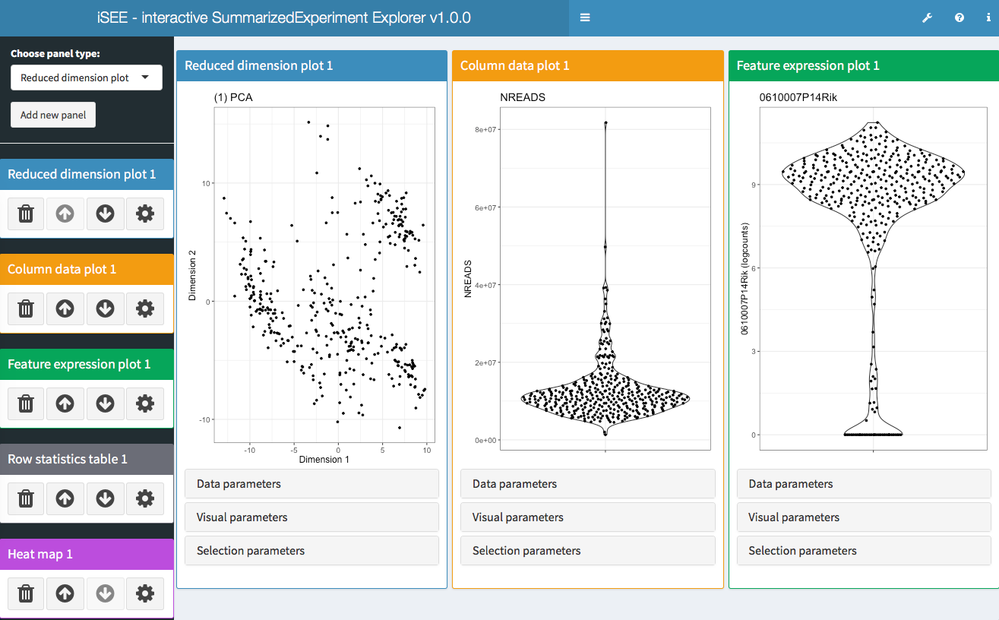
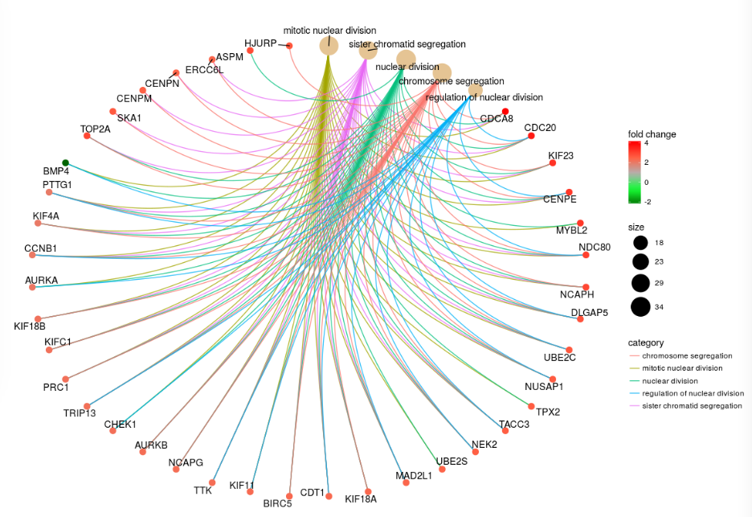
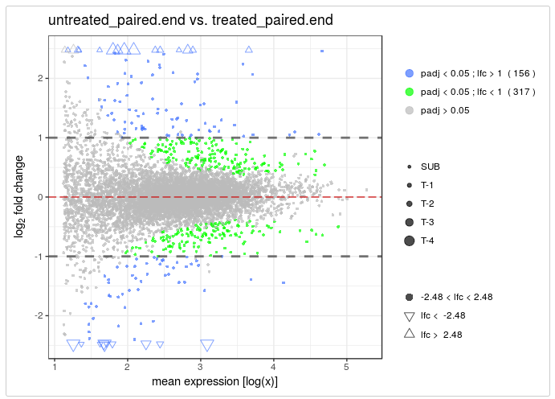

The Bioconductor 3.7 release was announced this week. I thought I would have a
look through the new packages and changes to existing packages and point out
some of my highlights. The descriptions below are my summaries, if you want to
see more detail you can read the full release notes [here][bioc-news].

# Single-cell RNA-seq

My interest is in single-cell RNA-seq analysis, so I am going to start off with
packages related to this.

## New packages

* [**BEARscc**][BEARscc] - noise estimation tool to assess scRNA-seq clusters
* [**ccfindR**][ccfindR] - collection of tools for cancer scRNA-seq analysis,
  including meta-gene identification and trees of cell clusters
* [**DESingle**][DESingle] - detects three types of differential expression
  betweeen two groups of cells, differential expression status, differential
  expression abundance and general differential expression
* [**DropletUtils**][DropletUtils] - utility functions for handling data from
  droplet technologies like the 10x Chromium
* [**iSEE**][iSEE] - Interactive SummarizedExperiment Explorer, Shiny-based GUI
  for exploring data in SummarizedExperiment objects, with special attention
  given to SingleCellExperiment

* [**LineagePulse**][LineagePulse] - differential expression and expression
  model fitting package for scRNA-seq, accounting for batch effects, dropout
  and sequencing depth
* [**MetaNeighbour**][MetaNeighbour] - quantify cell type replicability across
  datasets
* [**netSmooth**][netSmooth] - imputation of scRNA-seq data using biological
  networks
* [**scFeatureFilter**][scFeatureFilter] - correlation based method for
  removing genes affected by systematic noise
* [**singleCellTK**][singleCellTK] - Shiny-based interactive scRNA-seq analysis
  toolkit
* [**TENxBrainData**][TENxBrainData] - scRNA-seq data from 1.3 million mouse
  brain cells
* [**simpleSingleCell**][simpleSingleCell] - workflow implementing low-level
  scRNA-seq analysis using scran, scater and other Bioconductor packages

## Updates

* [**AUCell**][AUCell] - new Shiny app and plotting functions, support for
  sparse matrices
* [**clusterExperiment**][clusterExperiment] - support for hdf5 files and
  SingleCellExperiment objects
* [**monocle**][monocle] - changes to clustering algorithms
* [**scater**][scater] - changes to `calculateQCMetrics()` and plotting
  functions, some functionality moved to new packages
* [**scDD**][scDD] - proportion of zeros test now use the Wald test instead of
  likelihood ratio, performance improvements
* [**scran**][scran] - various bug fixes, improvments and new arguments
* [**SingleCellExperiment**][SingleCellExperiment] - new functions for clearing
  and setting information
* [**splatter**][splatter] - new options for Splat simulation library size and
  dropout parameters, new SparseDC simulation, improvfed print output
* [**zinbwave**][zinbwave] - now uses `counts` assay by default, uses can
  specify which assay to use, computational weights now saved as an assay,
  improved documentation

# Other areas

## New packages

* [**enrichplot**][enrichplot] - ggplot2 based functions for visualising
  gene-set enrichment results

* [**GARS**][GARS] - feature selection for high-dimensional datasets using
  genetic algorithms
* [**plyranges**][plyranges] - dplyr-like interface for Range and GenomicRanges
  objects
* [**PowerExplorer**][PowerExplorer] - simulation based power calculations
* [**singscore**][singscore] - rank-based single-sample gene set scoring method
* [**SummarizedBenchmark**][SummarizedBenchmark] - BenchDesign and
  SummarizedBenchmark classes for building, executing and evaluating software
  benchmark experiments
* [**vidger**][vidger] - function for visualising differential expression
  results from Cuffdiff, DESeq2 and edgeR

* [**BiocMetaWorkflow**][BiocMetaWorkflow] - workflow describing how to use
  BiocWorkflowTools to submit a single R Markdown document to both Bioconductor
  and F1000Research

## Updates

* [**DESeq2**][DESeq2] - performance improvements and deprecation of designs
  without replicates
* [**edgeR**][edgeR] - new `read10X()`, `nearestTSS()`, `nearestReftoX()`,
  `modelMatrixMeth()` and `filterByExpr()` functions
* [**GenomicRanges**][GenomicRanges] - GenomicRanges is now a list subclass,
  performance improvements
* [**minfi**][minfi] - preliminary support for DelayedArray minfi objects
* [**SummarizedExperiment**][SummarizedExperiment] - new `subset` method
* [**tximport**][tximport] - support for StringTie output

[bioc-news]: https://bioconductor.org/news/bioc_3_7_release/ "Bioc 3.7 news"
[BEARscc]: https://bioconductor.org/packages/release/bioc/html/BEARscc.html "BEARscc"
[ccfindR]: https://bioconductor.org/packages/release/bioc/html/ccfindR.html "ccfindR"
[DESingle]: https://bioconductor.org/packages/release/bioc/html/DEsingle.html "DESingle"
[DropletUtils]: https://bioconductor.org/packages/release/bioc/html/DropletUtils.html "DropletUtils"
[enrichplot]: https://bioconductor.org/packages/release/bioc/html/enrichplot.html "enrichplot"
[GARS]: https://bioconductor.org/packages/release/bioc/html/GARS.html "GARS"
[iSEE]: https://bioconductor.org/packages/release/bioc/html/iSEE.html "iSEE"
[LineagePulse]: https://bioconductor.org/packages/release/bioc/html/LineagePulse.html "LineagePulse"
[MetaNeighbour]: https://bioconductor.org/packages/release/bioc/html/MetaNeighbor.html "MetaNeighbour"
[netSmooth]: https://bioconductor.org/packages/release/bioc/html/netSmooth.html "netSmooth"
[plyranges]: https://bioconductor.org/packages/release/bioc/html/plyranges.html "plyranges"
[PowerExplorer]: https://bioconductor.org/packages/release/bioc/html/PowerExplorer.html "PowerExplorer"
[scFeatureFilter]: https://bioconductor.org/packages/release/bioc/html/scFeatureFilter.html "scFeatureFilter"
[singleCellTK]: https://bioconductor.org/packages/release/bioc/html/singleCellTK.html "singleCellTK"
[singscore]: https://bioconductor.org/packages/release/bioc/html/singscore.html "singscore"
[SummarizedBenchmark]: https://bioconductor.org/packages/release/bioc/html/SummarizedBenchmark.html "SummarizedBenchmark"
[vidger]: https://bioconductor.org/packages/release/bioc/html/vidger.html "vidger"
[TENxBrainData]: https://bioconductor.org/packages/release/data/experiment/html/TENxBrainData.html "TENxBrainData"
[simpleSingleCell]: https://bioconductor.org/packages/release/workflows/html/simpleSingleCell.html "simpleSingleCell"
[BiocMetaWorkflow]: https://bioconductor.org/packages/release/workflows/html/BiocMetaWorkflow.html "BiocMetaWorkflow"
[AUCell]: https://bioconductor.org/packages/release/bioc/html/AUCell.html "AUCell"
[clusterExperiment]: https://bioconductor.org/packages/release/bioc/html/clusterExperiment.html "clusterExperiment"
[DESeq2]: https://bioconductor.org/packages/release/bioc/html/DESeq2.html "DESeq2"
[edgeR]: https://bioconductor.org/packages/release/bioc/html/edgeR.html "edgeR"
[GenomicRanges]: https://bioconductor.org/packages/release/bioc/html/GenomicRanges.html "GenomicRanges"
[minfi]: https://bioconductor.org/packages/release/bioc/html/minfi.html "minfi"
[monocle]: https://bioconductor.org/packages/release/bioc/html/monocle.html "monocle"
[scater]: https://bioconductor.org/packages/release/bioc/html/scater.html "scater"
[scDD]: https://bioconductor.org/packages/release/bioc/html/scDD.html "scDD"
[scran]: https://bioconductor.org/packages/release/bioc/html/scran.html "scran"
[SingleCellExperiment]: https://bioconductor.org/packages/release/bioc/html/SingleCellExperiment.html "SingleCellExperiment"
[splatter]: https://bioconductor.org/packages/release/bioc/html/splatter.html "splatter"
[SummarizedExperiment]: https://bioconductor.org/packages/release/bioc/html/SummarizedExperiment.html "SummarizedExperiment"
[tximport]: https://bioconductor.org/packages/release/bioc/html/tximport.html "tximport"
[zinbwave]: https://bioconductor.org/packages/release/bioc/html/zinbwave.html "zinbwave"
