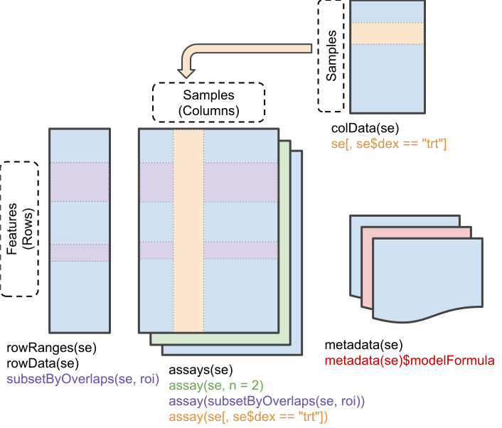
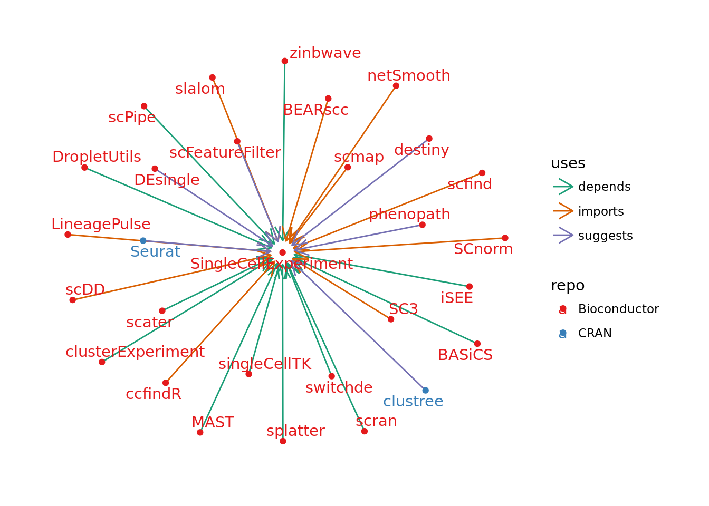
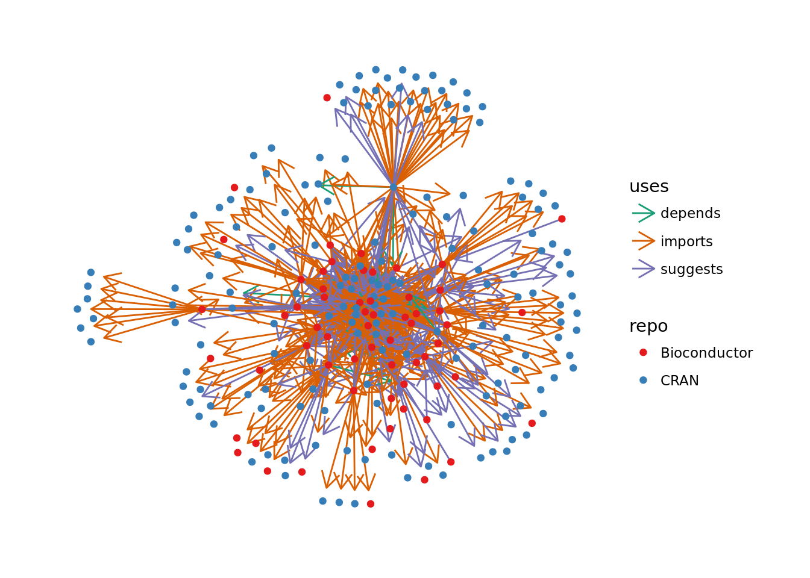
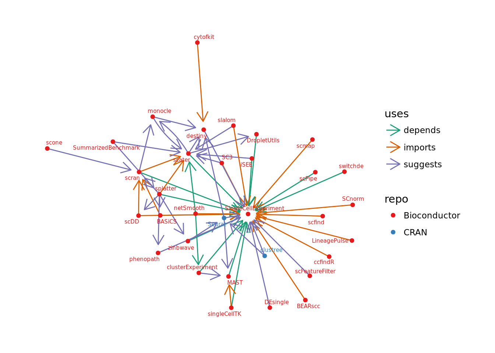
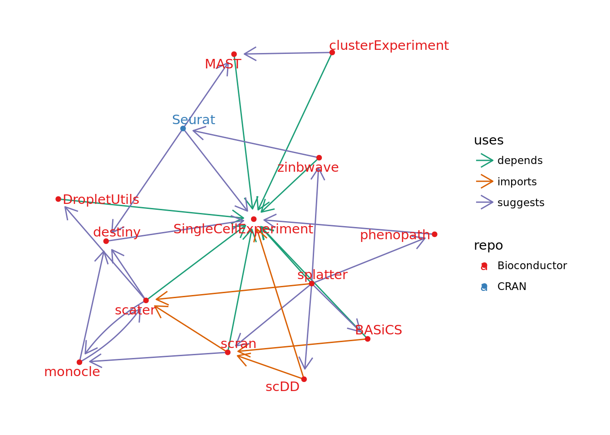
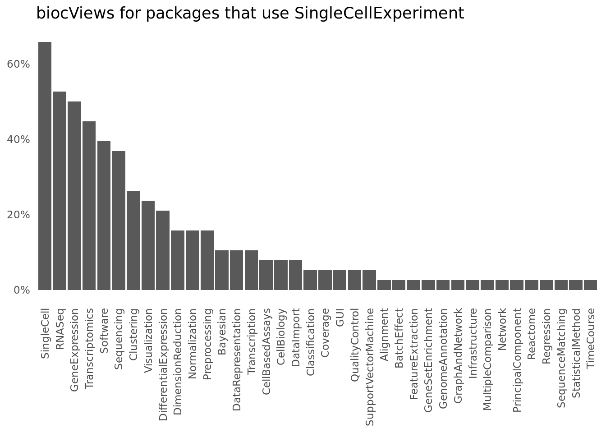

Over the last few years the number of methods for analysing scRNA-seq has
exploded and there is now well over 200 software tools available. Each of these
tools need to make a choice about how they store and represent the data used
during their analysis. One attempt to standardise the data structures that are
used is the [SingleCellExperiment][SingleCellExperiment] package created by
Davide Risso and Aaron Lun, with help from Keegan Korthauer. This package became
publicly available as part of the Bioconductor 3.6 release in October 2017.
Since we have recently had another Bioconductor release I thought I would have a
look at the community of tools that has been developed around
SingleCellExperiment.

# What is a SingleCellExperiment?

Before we have a look at what packages use the SingleCellExperiment it's
probably useful to briefly discuss what it is. The SingleCellExperiment object
is an extension of the older [SummarizedExperiment][SummarizedExperiment]
object. This is an S4 class  developed for use in Bioconductor packages with the
main parts being a central set of matrix "assays" along with tables providing
extra information about the rows and columns. There is also a metadata slot
which is a list containing any  other information related to the experiment.



One of the key benefits of using a structure like the SummarizedExperiment is
that all the data related to an analysis is held in one spot. This makes it
easier to pass things between functions or output results as well as reducing
the possibilities for mismatches. The SingleCellExperiment adds some extra
features that are useful for scRNA-seq analysis including:

* Slots for holding:
    * Dimenstionality reductions
    * Spike-in information
    * Size factors for normalisation
* Convenient access for named assays - counts, normcounts, cpm etc.

The idea is then that the SingleCellExperiment can be used by a range of
packages to store data during analysis and extended when required. Let's have
a look at what those packages are currently by seeing what depends on
SingleCellExperiment.

# Getting package information

First let's load the packages we need for this analysis.
[BiocPkgTools][BiocPkgTools] will need to be installed from GitHub but the rest
are on CRAN.

```r
library("BiocPkgTools") # https://github.com/seandavi/BiocPkgTools
library("tidygraph")
library("ggraph")
library("tidyverse")
```

We can use Sean Davis' BiocPkgTools package to get information about
Bioconductor packages, but then we need to do some filtering to get the
information we want. It turns out I needed to do this multiple times so here is
a function I wrote to make it a bit easier. It takes the database of information
about all Bioconductor packages, the name of a package we are interested in and
a flag indicating if we want normal or reverse dependencies.

```r
get_bioc_deps <- function(bpi, pkg, reverse) {
    deps <- bpi %>%
        filter(Package == pkg)

    if (reverse) {
        deps <- deps %>%
            select(depends = dependsOnMe, imports = importsMe,
                   suggests = suggestsMe)
    } else {
        deps <- deps %>%
            select(depends = Depends, imports = Imports,
                   suggests = Suggests)
    }

    deps <- deps %>%
        gather(key = "type", value = "package") %>%
        separate_rows() %>%
        filter(!is.na(package))

    if (reverse) {
        deps <- deps %>%
            mutate(package2 = pkg) %>%
            rename(package1 = package)
    } else {
        deps <- deps %>%
            mutate(package1 = pkg) %>%
            rename(package2 = package)
    }

    deps <- deps %>% select(package1, uses = type, package2)
}
```

If we use it to search for reverse dependencies of SingleCellExperiment we can
see it returns a data frame with which Bioconductor packages use
SingleCellExperiment and the relationship between them.

```r
bpi <- getBiocPkgList()
bioc_revdeps <- get_bioc_deps(bpi, "SingleCellExperiment", reverse = TRUE)
head(bioc_revdeps)
```

We can do a similar thing for CRAN packages with use of the
`tools::package_dependencies` function.

```r
get_cran_deps <- function(pkg, db, reverse) {

    types <- c("Depends", "Imports", "Suggests")

    deps <- sapply(types, function(type) {
        deps <- tools::package_dependencies(pkg, db, which = type,
                                            reverse = reverse)
        c(type = type, package = paste(deps[[1]], collapse = ", "))
    })

    deps <- deps %>%
        t() %>%
        as_data_frame() %>%
        mutate(type = tolower(type)) %>%
        filter(package != "") %>%
        separate_rows(package)

    if (nrow(deps) == 0) {
        return(tibble(package1 = character(), uses = character(),
                      package2 = character()))
    }

    if (reverse) {
        deps <- deps %>%
            mutate(package2 = pkg) %>%
            rename(package1 = package)
    } else {
        deps <- deps %>%
            mutate(package1 = pkg) %>%
            rename(package2 = package)
    }

    deps <- deps %>% select(package1, uses = type, package2)
}
db <- available.packages(repos = "http://cran.r-project.org")
cran_revdeps <- get_cran_deps("SingleCellExperiment", db, reverse = TRUE)
head(cran_revdeps)
```

# What uses SingleCellExperiment?

We now have two tables showing us which Bioconductor and CRAN packages make use
of SingleCellExperiment. Tables can be fairly boring to look at though so let's
use the relationships to construct a graph using [tidygraph][tidygraph].

```r
nodes <- bioc_revdeps %>%
    bind_rows(cran_revdeps) %>%
    select(-uses) %>%
    gather(key = id, value = package) %>%
    select(-id) %>%
    distinct() %>%
    mutate(repo = if_else(package %in% bpi$Package, "Bioconductor", "CRAN"))
edges <- bioc_revdeps %>%
    bind_rows(cran_revdeps) %>%
    rename(from = package1, to = package2)
graph <- tbl_graph(nodes = nodes, edges = edges)
```

We can now visualise the relationships using [ggraph][ggraph]:

```r
ggraph(graph, layout = "fr") +
    geom_edge_fan(aes(colour = uses),
                  arrow = arrow(length = unit(4, 'mm')),
                  end_cap = circle(3, 'mm')) +
    geom_node_point(aes(colour = repo)) +
    geom_node_text(aes(label = package, colour = repo), repel = TRUE) +
    scale_color_brewer(palette = "Set1") +
    scale_edge_color_brewer(palette = "Dark2") +
    theme_graph()
```



This doesn't tell us a lot we didn't already know but it does allow us to see
everything in one place. We can see that there are only a couple of CRAN
packages, which is unsurprising given that SingleCellExperiment is part of
Bioconductor, and that most packages either "import" or "depend" on
SingleCellExperiment.

What about the relationships between the packages that depend on
SingleCellExperiment? Are there communitites of related scRNA-seq analysis
tools?

# Adding an extra hop

We can reuse the functions we wrote earlier to get the dependencies (and reverse
dependencies) of our list of scRNA-seq packages. We will also do a little bit
of extra processing to tidy up some of the results.

```r
more_deps <- map2(nodes$package, nodes$repo, function(x, y) {
    if (y == "Bioconductor") {
        get_bioc_deps(bpi, x, FALSE)
    } else {
        get_cran_deps(x, db, FALSE)
    }
}) %>%
    bind_rows() %>%
    mutate(package2 = str_remove(package2, " ?\\(\\D+[0-9\\.]+\\)")) %>%
    filter(package2 != "R")
more_revdeps <- map2(nodes$package, nodes$repo, function(x, y) {
    if (y == "Bioconductor") {
        get_bioc_deps(bpi, x, TRUE)
    } else {
        get_cran_deps(x, db, TRUE)
    }
}) %>% bind_rows()
```

Let's build another graph and plot what we get. As you can see it's a bit
crowded so I have left off the package labels.

```r
nodes <- more_deps %>%
    bind_rows(more_revdeps) %>%
    select(-uses) %>%
    gather(key = id, value = package) %>%
    select(-id) %>%
    distinct() %>%
    mutate(repo = if_else(package %in% bpi$Package, "Bioconductor", "CRAN"))
edges <- more_deps %>%
    bind_rows(more_revdeps) %>%
    rename(from = package1, to = package2) %>%
    distinct()
graph <- tbl_graph(nodes = nodes, edges = edges)
ggraph(graph, layout = "fr") +
    geom_edge_fan(aes(colour = uses),
                  arrow = arrow(length = unit(4, 'mm')),
                  end_cap = circle(3, 'mm')) +
    geom_node_point(aes(colour = repo)) +
    #geom_node_text(aes(label = package, colour = repo), repel = TRUE) +
    scale_color_brewer(palette = "Set1") +
    scale_edge_color_brewer(palette = "Dark2") +
    theme_graph()
```



Our graph has a lot more information now, but is probably too complext to tell
us anything useful. In particularly we can see there are a lot of nodes around
the edges that have one package depending on them. Let's get rid of those by
removing sink node.

```r
graph <- tbl_graph(nodes = nodes, edges = edges) %>%
    activate(nodes) %>%
    filter(!node_is_sink())
ggraph(graph, layout = "fr") +
    geom_edge_fan(aes(colour = uses),
                   arrow = arrow(length = unit(4, 'mm')),
                   end_cap = circle(3, 'mm')) +
    geom_node_point(aes(colour = repo)) +
    geom_node_text(aes(label = package, colour = repo), size = 2,
                   repel = TRUE) +
    scale_color_brewer(palette = "Set1") +
    scale_edge_color_brewer(palette = "Dark2") +
    theme_graph()
```



That's much better! We can now see some of the structure between our packages.
There are quite few packages that rely on SingleCellExperiment but nothing else.
Removing source nodes as well will tidy this up a bit more.

```r
graph <- tbl_graph(nodes = nodes, edges = edges) %>%
    activate(nodes) %>%
    filter(!node_is_sink()) %>%
    filter(!node_is_source())
ggraph(graph, layout = "fr") +
    geom_edge_fan(aes(colour = uses),
                   arrow = arrow(length = unit(4, 'mm')),
                   end_cap = circle(3, 'mm')) +
    geom_node_point(aes(colour = repo)) +
    geom_node_text(aes(label = package, colour = repo),
                   repel = TRUE) +
    scale_color_brewer(palette = "Set1") +
    scale_edge_color_brewer(palette = "Dark2") +
    theme_graph()
```



Now we can see the core SingleCellExperiment package network. Apart from
SingleCellExperiment itself there are three main packages: scater, scran and
splatter. Scater and scran are two low-level scRNA-seq analysis package with
scater providing functions for tasks such as visualisation and filtering and
scran focusing more on normalisation and removal of batch effects. It is
unsurprising that these packages show up as Aaron Lun is heavily involved in
the development of both of them as well as SingleCellExperiment. Splatter is a
bit of a different case as it suggests many packages that provide the core
functions for it's simulations but isn't used by any other analysis packages.
There are a few other influential packages on the periphery of this network,
particularly monocle and Seurat.

# What do these packages do?

We have had a look at how packages that use SingleCellExperiment are related but
what do they actually do? Bioconductor categorises packages using "biocViews",
tags that describe software in various ways. Let's summarise those for the
packages that use SingleCellExperiment.

```r
plot_data <- bpi %>%
    filter(Package %in% bioc_revdeps$package1) %>%
    select(Package, biocViews) %>%
    separate_rows(biocViews) %>%
    group_by(biocViews) %>%
    summarise(count = n()) %>%
    arrange(-count) %>%
    mutate(prop = count / n()) %>%
    mutate(biocViews = factor(biocViews, level = biocViews))
ggplot(plot_data, aes(x = biocViews, y = prop)) +
    geom_col() +
    scale_y_continuous(labels = scales::percent) +
    ggtitle("biocViews for packages that use SingleCellExperiment") +
    theme_minimal() +
    theme(axis.text.x = element_text(angle = 90, hjust = 1, vjust = 0.5),
          axis.title = element_blank(),
          panel.grid = element_blank())
```



Unsurprisingly the top few categories ("SingleCell", "GeneExpression",
"RNASeq", "Transcriptomics", "Sequencing") are related to scRNA-seq data in
general, along with the "Software" tag. I actually find it a bit surprising
that these aren't more common with only <!-- `r round(plot_data[plot_data$biocViews == "SingleCell", "prop"] * 100)` --> 66
percent of packages labelled as "SingleCell". After these we have some of the
most common scRNA-seq analysis tasks, "Clustering", "Visualization",
"DifferentialExpression" and "DimensionReduction". This is similar to what we
see in the scRNA-tools database, but obviously from a much smaller sample.

We can't do the same thing for the CRAN packages, but as there are only a couple
of these we can just describe them. Seurat is perhaps the most complete R
scRNA-seq analysis covering most steps in a standard workflow. It's connection
to SingleCellExperiment is through functions that have recently been added
to convert to/from it's own object. Clustree is a package for visualising
clustering results in general and suggests SingleCellExperiment to provide a
convenience function for people working with scRNA-seq data.

# Where to from here?

It's only been about six months since SingleCellExperiment joined Bioconductor
release but we are already seeing a community of packages growing up around it.
Hopefully we see this continue and there is a new batch of packages using it in
the next Bioconductor release. For anyone who is working on a scRNA-seq package
I strongly encourage you to consider basing it around SingleCellExperiment. It
can take some time to get your head around how it works but the infrastructure
it provides will save you a lot of time in the long run. It also makes things a
lot easier for your uses who won't have to learn a new data structure to use
your package and can make use of a range of packages without having to convert
between objects. If you don't want to be locked into the Bioconductor ecosystem
think about using the [Seurat][Seurat] object instead or if you work in Python
consider the [anndata][anndata] object. There is also the [loom][loom] format
which has both R and Python interfaces. Whatever standard works for you everyone
will be better off if the community can make use of a small number of data
structure rather than each package using their own.

[SingleCellExperiment]: https://www.bioconductor.org/packages/SingleCellExperiment "SingleCellExperiment"
[SummarizedExperiment]: https://www.bioconductor.org/packages/SummarizedExperiment "SummarizedExperiment"
[BiocPkgTools]: https://github.com/seandavi/BiocPkgTools
[tidygraph]: https://cran.r-project.org/package=tidygraph "tidygraph"
[ggraph]: https://cran.r-project.org/package=ggraph "ggraph"
[Seurat]: https://cran.r-project.org/package=Seurat "Seurat"
[anndata]: https://anndata.readthedocs.io/en/latest/ "anndata"
[loom]: http://loompy.org/ "loom"
