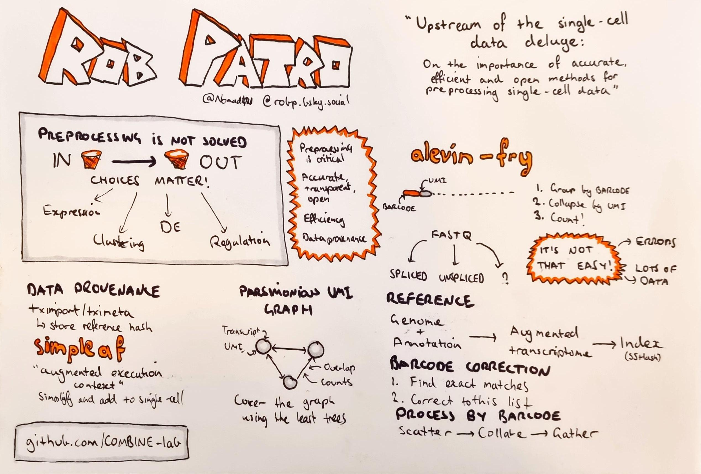
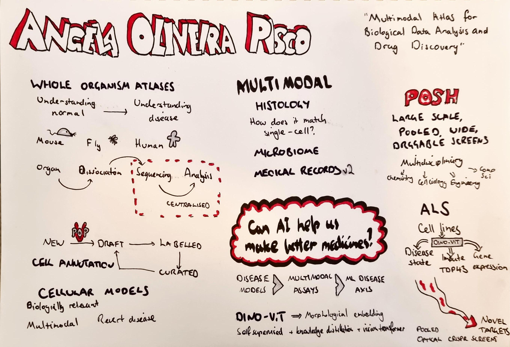
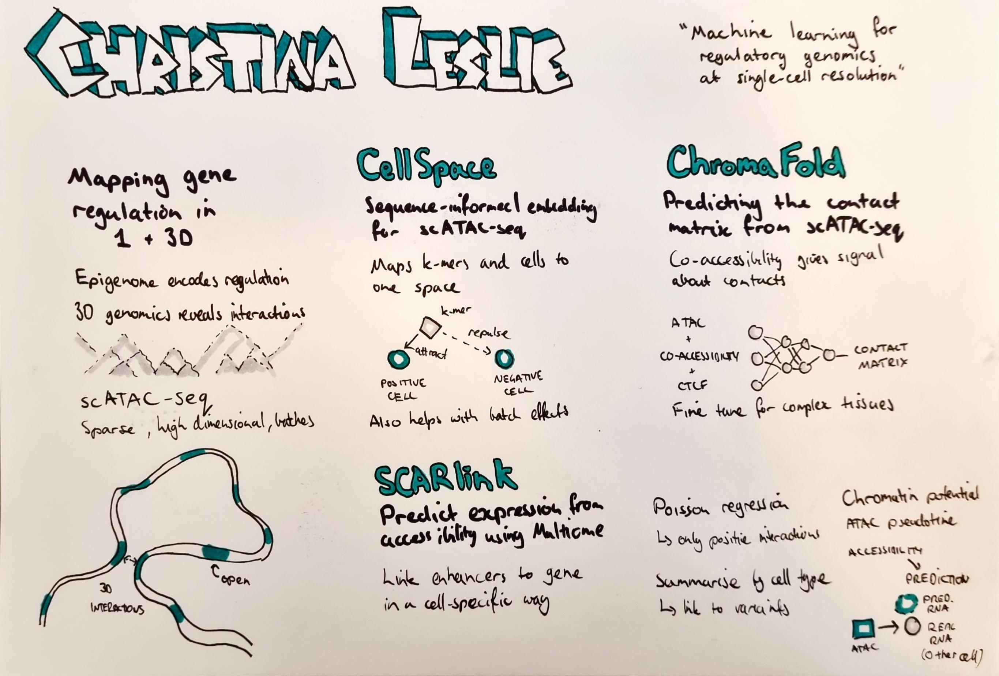
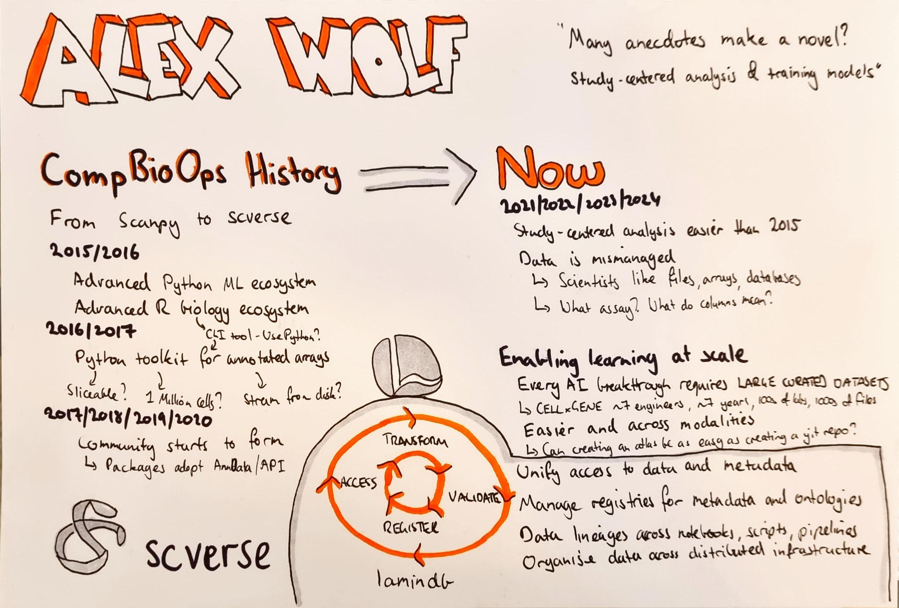
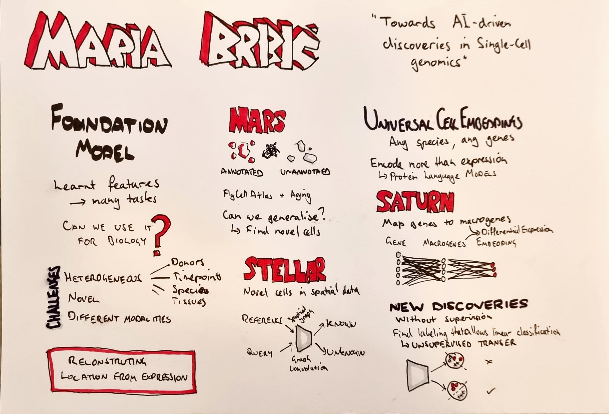
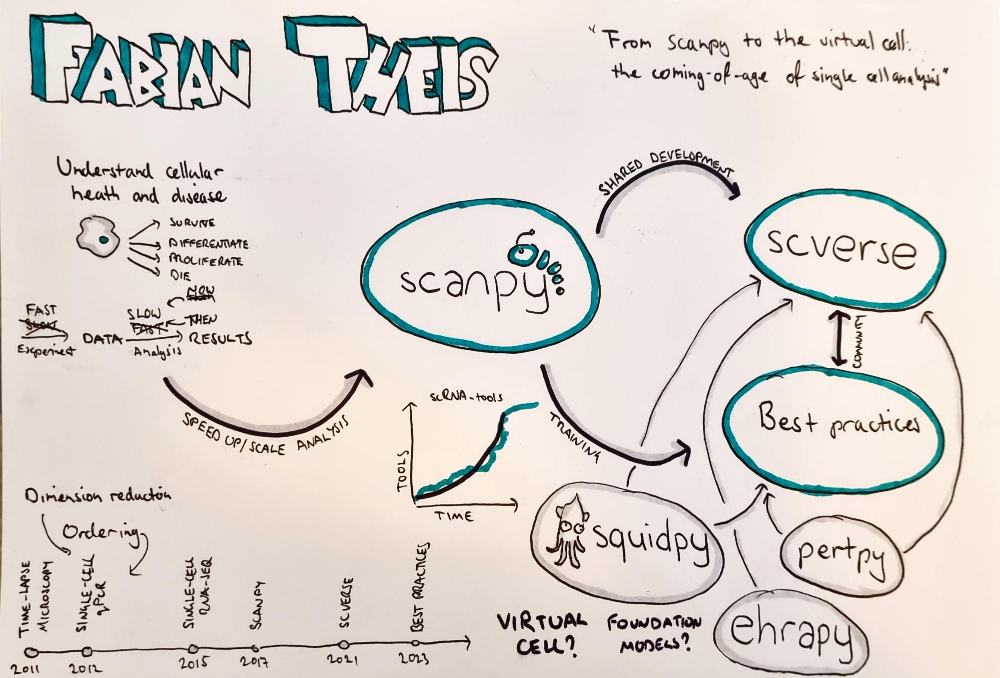

# Summary

This week was the first ever [scverse conference](https://scverse.org/conference2024) held in Munich from 10-12 September.
While it was based around the [scverse](https://scverse.org/) software community the conference covered more than just those core packages for single-cell analysis and included talks on a range of biological topics as well as a diverse range of workshops.
Putting together any conference is a lot of work, but particularly the first attempt for what is still a new community.
I was very impressed with what the organisers were able to put together, how smoothly everything ran and the number of attendees from around the world.
It is great to see these growing into a real community that is more than just the core maintainers from a few packages and I look forward to seeing what they do in the years ahead.
As with any effort on the work of students, the difficulty is always maintaining momentum as those people move on and everything is based to a new generation but I am hopeful they are building something that will be sustainable with support from senior academics and industry.

# Keynote sketchotes

Here are my sketchnotes summarising the keynote talks (click to expand):

::: {layout-nrow=3}
{fig-alt="Sketchnotes of Rob Patro's scverse conference keynote 'Upstream of the single-cell data deluge: On the importance of accurate, efficient and open methods for preprocessing single-cell data'" .lightbox group="scverse-sketchnotes"}

{fig-alt="Sketchnotes of Angela Oliveira Pisco's scverse conference keynote 'Multimodal Atlas for Biological Data Analysis and Drug Discovery'" .lightbox group="scverse-sketchnotes"}

{fig-alt="Sketchnotes of Christina Leslie's scverse conference keynote 'Machine learning for regulatory genomics at single-cell resolution'" .lightbox group="scverse-sketchnotes"}

{fig-alt="Sketchnotes of Alex Wolf's scverse conference keynote 'Many anecdotes make a novel? Study-centered analysis & training models'" .lightbox group="scverse-sketchnotes"}

{fig-alt="Sketchnotes of Maria Brbic's scverse conference keynote 'Towards AI-driven discoveries in Single-Cell genomics'" .lightbox}

{fig-alt="Sketchnotes of Fabian Theis's scverse conference keynote 'From scanpy to the virtual cell: the coming-of-age of single cell analysis'" .lightbox group="scverse-sketchnotes"}
:::
